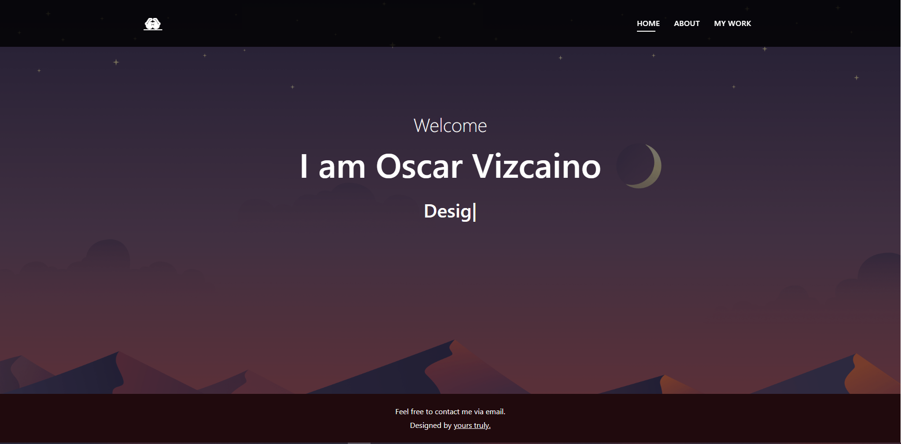
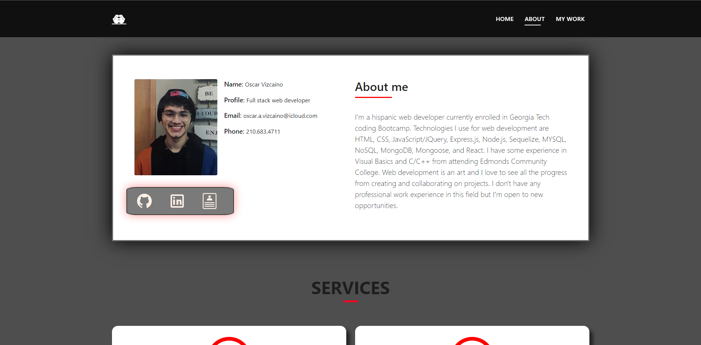
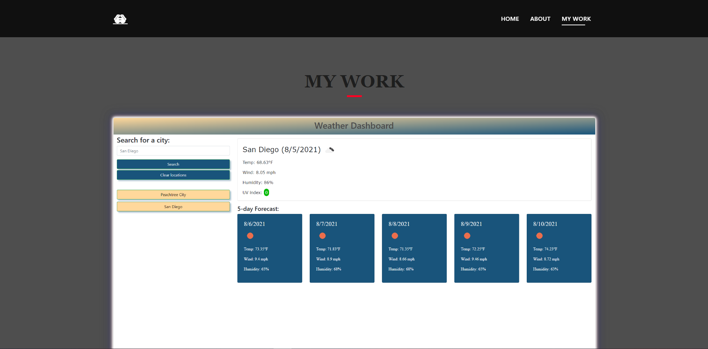

# react-portfolio

A professional portfolio using REACT

## Technologies

    -HTML
    -CSS
    -JS
    -REACT
    -Typed.js

## Dependencies

run npm i to install npm dependencies if forked into your local drive

## Screenshots

## Links

Deployed Application: https://github.com/oscarV42/react-portfolio

GitHub Repo: https://github.com/oscarV42/react-portfolio

## Questions

If you have any questions about the repo, open an issue or contact me directly at oscar.a.vizcaino@icloud.com. You can find more of my work at
[oscarV42](https://github.com/oscarV42/).
